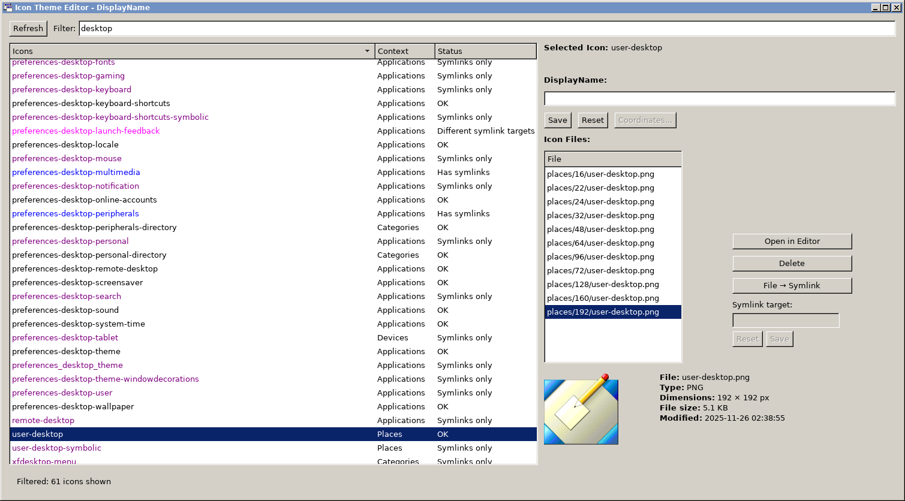

# icon-theme-editor
super-puper-power-tower editor for Linux icon themes)))

**Installation:**
```
git clone https://github.com/nestoris/icon-theme-editor.git
```

**Usage:**
```
cd icon-theme-editor
gjs icon-theme-editor /path/to/your/theme/index.theme
```

**Requirements:**
```
GTK3, GJS or CJS (may use old versions of CJS 128.1)
```

**Screenshot:**

