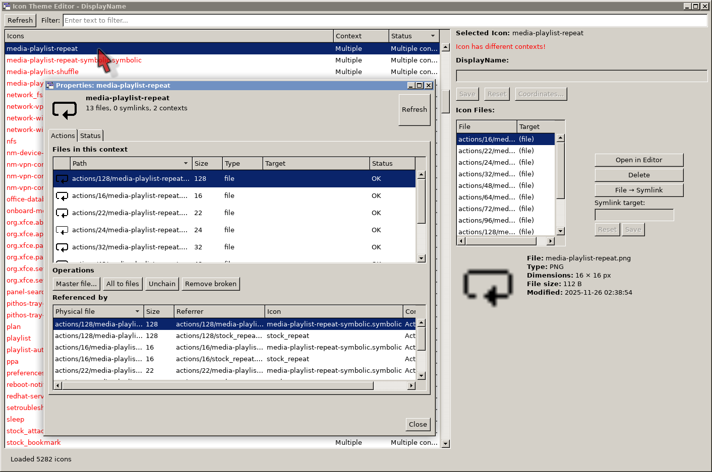
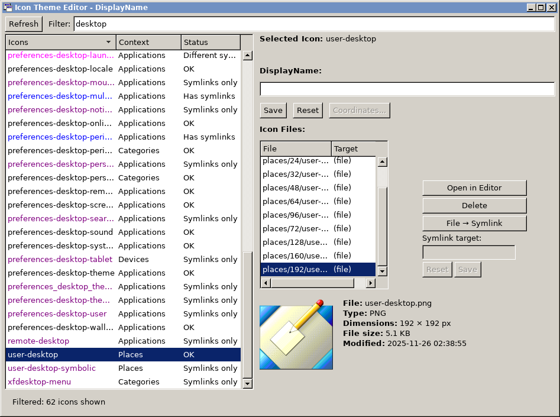
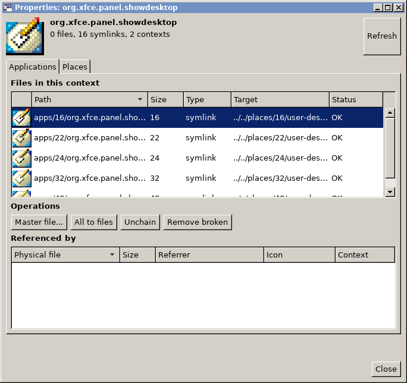

# Icon Theme Editor
## super-puper-power-tower editor for Linux icon themes)))

I'm kidding, it's my try to make something for easy theme creating. So this is a tool to find and fix some (not all) bugs in your hand-made Icon Theme for GNU/Linux.

**Installation:**
```
git clone https://github.com/nestoris/icon-theme-editor.git
```

**Usage:**
```
cd icon-theme-editor
gjs icon-theme-editor.js /path/to/your/theme/index.theme
```

**Requirements:**
```
GTK3, GJS or CJS (may use old versions of CJS 128.1)
```

**Screenshots:**

Overview:



Main window:



Properties of double-clicked icon name:


